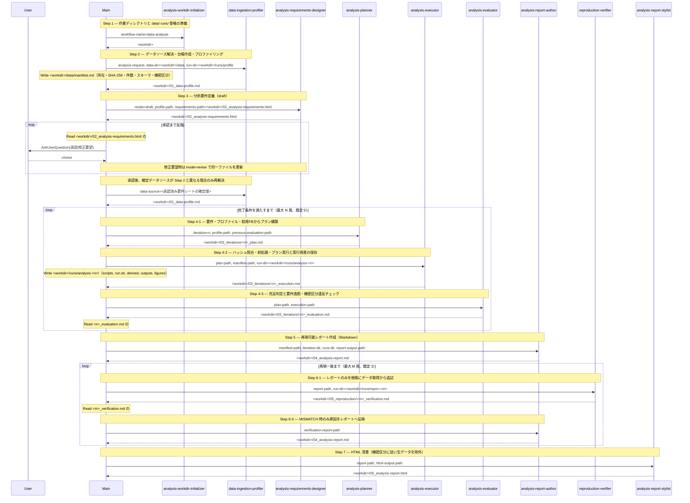

# ワークフロー構成設計書: data-analysis

## 設計サマリ

### 前回からの主な変更点

**設計内容の変更はない。** ユーザー承認済みの構成（7 ステップ／新規サブエージェント 9 体／流用 0 件／How スキル 4 本／`data/` と `runs/` の規約）はそのまま維持し、前版に残っていた **旧版の件数・番号の表記だけを現行値に揃えた**。

1. `## 設計サマリ` の「追加確認観点（本設計で下した構造的判断）」の自己完結の項で、生成物の内訳を `.claude/agents/*.md` **9 本** ／ `.claude/skills/*/SKILL.md` **4 本** に修正した（前版は 8 本／3 本のまま）。
2. 「自動呼び出し可否」の根拠にあった「6 ステップの重量級ワークフロー」を **7 ステップ** に修正した。
3. `## ⚠️ /context-engineering からの逸脱` の想定リスクにあった「サブエージェント 8 本 ＋ How スキル 3 本」を **9 本 ＋ 4 本** に修正した。
4. `## 生成される How スキル` の `analysis-design-cycle` の利用者表記「メイン（SKILL.md の Step 2）」を、承認ゲートの実際の位置である **Step 3** に修正した。
5. 前版の差分表記（「3 本 → 4 本」「既存 8 体」など、旧版からの増減を示す書き方）を確定値の表記に改めた。`analysis-data-handling` の項の見出しを「生成される How スキルは **4 本**」に、サブエージェント構成案の根拠を「他の 8 体」に、How スキル 4 本の根拠の末尾を「この 4 本構成は承認済みである」に置き換えた。

上記 5 点以外の本文・シーケンス図・機械可読セクション（`- name:` 群）は前版から変更していない。設計サマリと本文の件数（サブエージェント 9 体・流用 0 件・How スキル 4 本・7 ステップ・成果物の番号接頭辞 `01_`〜`06_`）は全箇所で一致している。

以下は本設計書全体の要約であり、本文と矛盾しない。各項目は **推奨値** と **根拠** を 1 行で示す。

### 必須確認観点

- **ワークフロー名（識別子）**: `data-analysis`（ケバブケース、起動は `/data-analysis`）
  - 根拠: `workflow-details` の主題がそのまま「データ分析の実行手順一式」であり、リポジトリ名 `data-analysis-agent` とも一致する。`analysis` 単独では対象が曖昧、`data-analysis-agent` はワークフローではなくプロジェクトの名前なので避けた。
- **目的と利用シーン**: 「要件定義 → 反復分析 → 再現可能レポート化 → 第三者再現検証 → HTML 清書」を 1 コマンドで通す、再現性を最重視したデータ分析ワークフロー
  - 根拠: `workflow-details` が挙げた 5 局面をそのまま採用。ユーザーが繰り返し行う定型作業であり、`/context-engineering` の「人間が起点として呼び出す定型作業＝ワークフロースキル」に合致する。
- **全体手順（ステップ数・各ステップの入出力）**: 7 ステップ（Step 1 作業準備 → **Step 2 データ取り込みとプロファイリング** → Step 3 分析要件定義＋承認ゲート → Step 4 分析ループ（plan→execute→evaluate、既定 5 周上限）→ Step 5 再現可能レポート作成（Markdown）→ Step 6 再現実験ループ（既定 3 周上限）→ Step 7 レポート清書（HTML））
  - 根拠: `workflow-details` の記述順に 1 対 1 対応させたうえで、データ取り込み・プロファイリングを **要件定義の前** に 1 ステップとして挿入した。実データの列・型・件数・欠損を知らずに書いた要件は「判定可能な完了条件」にならず、承認ゲートでユーザーが判断する材料も欠けるため。各ステップの入出力は `## 全体手順（Step 1〜N）` に記載。
- **サブエージェント構成案**: **新規 9 体**（`analysis-workdir-initializer` / **`data-ingestion-profiler`** / `analysis-requirements-designer` / `analysis-planner` / `analysis-executor` / `analysis-evaluator` / `analysis-report-author` / `reproduction-verifier` / `analysis-report-stylist`）、**流用 0 体**
  - 根拠: 自己完結の要求により、外部プラグインが提供する `workflow-init` を流用せず `analysis-workdir-initializer` を新設した。調査レポートのとおりプロジェクト内の既存サブエージェントは 0 件のため、流用候補は存在しない。プラン立案・実行・評価を分けたのは、立案者に自分の結果を採点させない独立性を確保するため。データ取り込み・プロファイリングを他の 8 体のいずれかに兼務させず独立した 1 体にしたのは、要件定義の前に完了している必要があり（`analysis-requirements-designer` には兼務させられない）、かつ分析ループの周回に依存しない一度きりの責務だから（`analysis-executor` にも兼務させられない）。
- **中間生成物の配置とファイル名規約**: `tasks/<yyyy-mm-dd>_data-analysis/` 配下に **`data/manifest.md` ＋ `data/raw/` ＋ `data/snapshot/`** / `01_data-profile.md` / `02_analysis-requirements.html` / `03_iterations/<n>_{plan,execution,evaluation}.md` / `04_analysis-report.md` / `05_reproduction/<m>_verification.md` / `06_analysis-report.html` ＋ **実行資産アーカイブ `runs/profile/` `runs/analysis-<n>/` `runs/repro-<m>/`**
  - 根拠: 番号接頭辞を成果物の生成順に一致させ、反復するものだけサブディレクトリに束ねる。データは番号を持たない `data/` に置く（特定の Step の成果物ではなく、Step 2 以降の全工程が参照する台帳のため）。実行資産は「ログ中のコード断片」ではなく、`scripts/` ＋ `run.sh` ＋ `environment.md` ＋ `outputs/` ＋ `figures/` ＋ `derived/` として **後から単体で再実行できる形** で残す。全体を `/context-engineering` の揮発系コンテキスト（`tasks/` 配下）に閉じ、恒久ドキュメントを汚さない。
- **自動呼び出し可否**: `disable-model-invocation: true`（明示呼び出し専用）を推奨
  - 根拠: メリットは、長時間・多ファイル生成・コード実行・複数のユーザー承認ゲートを伴う重い処理が、会話中の「データ分析」という語だけで誤発火しないこと。デメリットは、ユーザーが `/data-analysis` と明示的に打つ必要があり、Claude Code の自主判断による起動ができないこと。逆に自動呼び出しを許可する（frontmatter から `disable-model-invocation` を外す）場合、メリットは「このデータを分析して」と言うだけで起動する利便性、デメリットは軽い集計依頼にまで 7 ステップの重量級ワークフローが起動し、作業ディレクトリと承認ゲートを毎回作ってしまうこと。

### 追加確認観点（インプットデータの取り扱い — 今回の修正要望への対応）

- **インプットデータの受け取り方**: ワークフロー起動時の引数は **自然文 1 本（`analysis-request`）のまま** とし、そこにデータの所在を書いてもらう。構造化引数（`--data <path>` `--db <dsn>` 等）は導入しない
  - 根拠: データソースはローカルファイル・ディレクトリ・DB 接続・API/URL・複数ソースの組み合わせと多様で、引数スキーマを固定すると表現しきれないものが必ず出る。解決と厳密化は Step 2 の `data-ingestion-profiler` が担い、確定は Step 3 の承認ゲートでユーザーが行う。代替案（構造化引数）はタイプ量が減る一方、想定外のソース形態を弾いてしまう。
- **データソースが引数に書かれていない場合の扱い**: `data-ingestion-profiler` は **推測でデータを選ばない**。候補を列挙して「未確定」と記録し、Step 3 の要件シートに確認項目として出す
  - 根拠: 間違ったデータで要件を固め分析を 5 周回す損失が、1 往復の確認コストを大きく上回る。承認ゲートでユーザーがデータソースを指定・変更した場合、メインは `data-ingestion-profiler` を再起動してから Step 4 へ進む。
- **元データの取り込み方**: 既定は **コピーせず参照**。`data/manifest.md` に絶対パス・SHA-256・サイズ・件数・スキーマ・取得日時を記録し、分析実行の直前にハッシュを照合する
  - 根拠: 再現性に必要なのは「同じデータであることを検証できること」であり、複製そのものではない。ハッシュ照合があれば元データの差し替えを検知できる。`tasks/` 配下に大容量データを溜めず、機密データの複製も作らずに済む。
- **コピー・スナップショットを取る例外**: (a) 非機密かつ小容量（既定 100 MB 未満）のローカルファイルは `data/raw/` にコピーしてよい。(b) 再取得で内容が変わりうるソース（DB クエリ・API・時刻依存の抽出）は、非機密なら決定的スナップショットを `data/snapshot/` に保存し、機密なら **保存せず** 決定的な取得クエリと抽出条件のみ記録する
  - 根拠: 参照だけでは「元データが消えた・更新された」場合に再現不能になる。一方、機密データを作業ディレクトリに落とすリスクは再現性の利益を上回るため、機密区分が最優先で保存を禁じる。閾値 100 MB は要件シートで上書きできる。
- **データプロファイリングの位置**: 要件定義の **直前**（Step 2）に置き、結果 `01_data-profile.md` を要件シートの材料にする
  - 根拠: 「欠損の多い列を分析対象にしない」「カーディナリティが高すぎる列で層別しない」といった判断は、実データを見なければ下せない。要件シートの完了条件を実データに照らして判定可能な形にできる。代替案（要件定義の直後にプロファイリング）は、要件を書き直す手戻りが承認ゲートを 2 周させる。
- **プロファイリングの内容**: 列名・型・件数・欠損率・基本統計（数値列）・カテゴリのカーディナリティと上位値・日付列の期間範囲・重複行・明らかな異常値。図表は `runs/profile/figures/` に保存し、要件シートにも要点を反映する
  - 根拠: ユーザーが承認ゲートで「このデータでこの分析は成立するか」を判断できる最小限。網羅的な自動プロファイルレポートは情報量が多すぎて判断材料にならない。
- **前処理（クレンジング・結合・派生列）の扱い**: 専用ステップを設けず **分析ループ内で行う**。前処理スクリプトも `runs/<run-id>/scripts/` に保存し、派生データは `runs/<run-id>/derived/` に出力する。前処理の入力は必ず `data/manifest.md` 記載の原データから始める
  - 根拠: 必要な前処理は分析観点ごとに変わり、要件確定前に固定できない。派生データを `derived/` に置いて `run.sh` から再生成可能にすれば、「手作業で作った中間ファイルがないと再現できない」という最悪のケースを構造的に防げる。`analysis-run-recording` に `derived/` を追加して規約化する。
- **機密性の扱い**: 要件シートに **機密区分** を必須項目として持たせ、区分ごとに「コピー可否」「レポートへの生データ掲載可否」「図表への個票表示可否」を決める。既定は保守側（機密の可能性があれば掲載しない）
  - 根拠: 生成物のうち `04_analysis-report.md` と `06_analysis-report.html` は第三者に共有される前提の成果物であり、個人情報の混入は取り返しがつかない。区分をユーザーが承認ゲートで明示的に確定する構造にすることで、暗黙の判断を残さない。
- **データ取り扱い規約を How スキル `analysis-data-handling` として新設する**: 生成される How スキルは **4 本**
  - 根拠: 取り込み方針・台帳の記録項目・ハッシュ検証・機密区分ごとの掲載可否を、`data-ingestion-profiler`（書き手）/ `analysis-executor`（検証）/ `analysis-report-author`（転記・掲載判断）/ `analysis-report-stylist`（掲載判断）/ `reproduction-verifier`（照合・掲載判断）の **5 体** が同じ前提で扱う必要がある。5 本のプロンプトに書き写すのは DRY 違反。代替案は `analysis-run-recording` に畳んで How スキルを 3 本に留めることだが、「実行の記録」と「データの取り扱い（機密・台帳・検証）」は関心が異なり、1 本が 2 つの主題を抱えることになる。この 4 本構成は承認済みである。

### 追加確認観点（本設計で下した構造的判断）

- **プロジェクト内で自己完結させる**: 生成物（SKILL.md ／ `.claude/agents/*.md` 9 本 ／ `.claude/skills/*/SKILL.md` 4 本）は、外部プラグインのサブエージェント・スキルを一切参照しない
  - 根拠: 修正要望の明示指定。本リポジトリをクローンした別環境にプラグインがある保証がないため、「動く条件」をリポジトリ内に閉じる。トレードオフとして、設計サイクル契約（draft / revise ＋承認ゲート）が `analysis-design-cycle` としてプロジェクト内に 1 本増える（プラグインの `design-cycle` と概念的に重複する）。この重複はリポジトリ境界をまたぐため DRY 違反とはみなさない。
- **分析要件の情報源を HTML 1 本に一本化する**: `02_analysis-requirements.html` を要件の唯一の情報源とし、Markdown 版を別途持たない
  - 根拠: `workflow-details` の「すり合わせは HTML で行う」を満たしつつ、Markdown 版との二重管理（revise 時の同期漏れ）を避ける（DRY）。代替案は「Markdown を正、HTML を派生ビュー」だが、承認のたびに 2 ファイルを同期する必要があり脆い。
- **HTML デザイン指針を How スキル `html-deliverable-design` として新設する**: テンプレートは作らず、指針のみをスキル 1 本に置く
  - 根拠: `workflow-details` の「テンプレートは不要、デザイン指針は欲しい」に対応。HTML を書く主体が `analysis-requirements-designer` と `analysis-report-stylist` の 2 体あるため、`/context-engineering` の「複数サブエージェント共有の How は How スキルへ」に従う。両者のプロンプトに指針を書き写す案は DRY 違反。
- **実行資産の保存契約を How スキル `analysis-run-recording` として新設する**: ディレクトリ構成・`run.sh` の作り・環境記録・出力の残し方を 1 本に定める
  - 根拠: 「保存して後から参照・再実行できる」ことを、書き手（`analysis-executor` / `reproduction-verifier`）と読み手（`analysis-report-author`）の 3 体が同じ規約で扱う必要がある。3 体のプロンプトに同じ規約を書き写すのは DRY 違反であり、`/context-engineering` の「複数サブエージェント共有の How は How スキルへ」に従う。
- **反復上限の既定値**: 分析ループ 5 周、再現実験ループ 3 周。いずれも `02_analysis-requirements.html` に記載され、要件定義時にユーザーが上書きできる
  - 根拠: 分析ループの 5 は `workflow-details` の明示指定。再現実験は「原因を探してレポートに反映」する修正ループであり、3 周で収束しなければ人間の判断を仰ぐべきという判断。

## 目的と利用シーン

分析対象と目的が決まっていないところから、第三者が再現できるレポートまでを一気通貫で作るためのワークフロー。

- **目的**: 分析の「やりっぱなし」を防ぐ。**入力データの姿と所在を先に押さえたうえで** 要件をユーザーと合意してから始め、試行ごとに要件充足度と要件逸脱を判定し、最後に第三者視点の再現検証を通したうえで、読みやすい HTML レポートに落とす。
- **利用シーン**:
  - 手元のデータセット（CSV / DB / API 等）について、目的は言語化できているが分析手順が固まっていないとき。
  - データの中身を十分に把握できておらず、「何が分析できるか」から詰めたいとき（Step 2 のプロファイリングが材料になる）。
  - 分析結果を他者に共有する必要があり、「同じ手順で同じ結果が出る」ことの担保が求められるとき。
  - 一度の分析で答えが出ず、結果を見て切り口を変えながら詰めていく必要があるとき。
- **想定しない使い方**: 単発の集計・グラフ 1 枚の作成。要件定義と再現検証のコストが見合わない。

## 全体手順（Step 1〜N）

### Step 1 — 作業ディレクトリ準備

- **委譲先**: `analysis-workdir-initializer`
- **入力**: `workflow-name`: `data-analysis`
- **責務**: `tasks/<yyyy-mm-dd>_data-analysis/` と、その配下の固定サブディレクトリ骨格（`data/` / `03_iterations/` / `05_reproduction/` / `runs/`）を作成する。
- **出力**: 作業ディレクトリの絶対パス（メインが `<workdir>` として保持）

### Step 2 — データ取り込みとプロファイリング

- **委譲先**: `data-ingestion-profiler`
- **入力**: `analysis-request`（スキル起動時の引数全文）/ `data-dir`: `<workdir>/data` / `profile-output-path`: `<workdir>/01_data-profile.md` / `run-dir`: `<workdir>/runs/profile` / `data-source`（Step 3 承認後の再起動時のみ。確定したデータソースの記述）
- **責務**: `analysis-request`（再起動時は `data-source`）からデータソースを解決し、`analysis-data-handling` の規約に従って `data/manifest.md` に台帳を作る。各ソースについて所在・SHA-256・サイズ・件数・スキーマ・取得日時・機密区分の暫定値を記録し、必要に応じてコピー（`data/raw/`）またはスナップショット（`data/snapshot/`）を作る。あわせてデータの姿（列・型・欠損率・基本統計・カテゴリのカーディナリティ・期間範囲・重複・異常値）を `01_data-profile.md` にまとめる。プロファイリングに使ったスクリプトと出力は `run-dir` に `analysis-run-recording` の規約で保存する。
- **出力**: `<workdir>/01_data-profile.md`（＋ `<workdir>/data/manifest.md`、`runs/profile/` 配下の実行資産）
- **データソース未確定時**: `analysis-request` にデータの所在が書かれていない場合、推測でデータを選ばず、`01_data-profile.md` の `## データソース` に `UNRESOLVED` と候補一覧を記録して終了する。確定は Step 3 の承認ゲートで行う。

### Step 3 — 分析要件定義（draft → 承認ゲート → revise 反復）

プロジェクト内 How スキル `analysis-design-cycle` の設計サイクル契約に従う。設計係は `analysis-requirements-designer`（`draft` / `revise` の 2 モード）。

- **Step 3-draft**
  - **入力**: `mode: "draft"` / `analysis-request` / `profile-path`: `<workdir>/01_data-profile.md` / `requirements-path`: `<workdir>/02_analysis-requirements.html`
  - **責務**: ユーザーに問い返さず、プロファイル結果を踏まえた推奨値で埋めた分析要件シート（HTML）を Write する。データソース・機密区分・完了条件は実データの姿に照らして判定可能な形で書く。
  - **出力**: `<workdir>/02_analysis-requirements.html`
- **Step 3-review（承認ゲート）**
  - **メイン側の処理**: `02_analysis-requirements.html` の `<section id="design-summary">` のみを限定 Read し、その内容をユーザーへのメッセージとして提示する。続けて `AskUserQuestion` を 1 通発火し（質問文に同ファイルの絶対パスを含める）、`承認` / `修正要望あり` を取得する。
  - **修正要望時**: 自由記述 1 件で `modification-request` を取得し、`analysis-requirements-designer` を `mode: "revise"` で再起動して手順を繰り返す（反復上限なし）。
  - **承認時**: 要件を確定し、`<section id="design-summary">` から **確定データソース**・**機密区分**・**完了条件（受け入れ基準）**・**最大試行回数 `N`（既定 5）**・**最大再現試行回数 `M`（既定 3）** を取り出す。
  - **データソース再解決**: 確定データソースが Step 2 時点と異なる場合（`UNRESOLVED` だった、またはユーザーが変更した）、メインは `data-ingestion-profiler` を `data-source` 付きで再起動し、`01_data-profile.md` と `data/manifest.md` を更新してから Step 4 へ進む。

### Step 4 — 分析ループ（plan → execute → evaluate、最大 `N` 周）

第 `n` 周（`n` = 1..`N`）で以下を直列に実行する。

1. **プラン構築** — `analysis-planner`
   - **入力**: `requirements-path` / `profile-path`: `<workdir>/01_data-profile.md` / `iteration`: `n` / `plan-output-path`: `<workdir>/03_iterations/<n>_plan.md` / `previous-evaluation-path`（2 周目以降のみ）: `<workdir>/03_iterations/<n-1>_evaluation.md`
   - **責務**: 要件・データプロファイル・前周のフィードバックから、今周で実行する分析手順（必要な前処理を含む）を書き下す。
   - **出力**: `<n>_plan.md`
2. **プラン実行** — `analysis-executor`
   - **入力**: `plan-path` / `requirements-path` / `manifest-path`: `<workdir>/data/manifest.md` / `execution-output-path`: `<workdir>/03_iterations/<n>_execution.md` / `run-dir`: `<workdir>/runs/analysis-<n>`
   - **責務**: 実行前に `manifest-path` 記載のハッシュと実データを照合してから、プランを実行する。前処理を含む実行スクリプト・コマンド・環境情報・標準出力／標準エラー・派生データ・生成図表を `run-dir` 配下に **後から単体で再実行できる形** で保存し（`analysis-run-recording` の規約に従う）、結果と観察事実を実行ログにまとめる。
   - **出力**: `<n>_execution.md`（＋ `runs/analysis-<n>/` 配下の実行資産一式）
3. **評価** — `analysis-evaluator`
   - **入力**: `requirements-path` / `plan-path` / `execution-path` / `evaluation-output-path`: `<workdir>/03_iterations/<n>_evaluation.md`
   - **責務**: 実行結果が完了条件を満たすかを判定し、要件からの逸脱（台帳外データの利用・機密区分違反を含む）の有無を点検し、満たさない場合は次周プランへのフィードバックを書く。
   - **出力**: `<n>_evaluation.md`（`## 判定` に `SATISFIED` / `CONTINUE` のいずれか 1 語を含む）
4. **メインのループ制御**: `<n>_evaluation.md` の `## 判定` のみを限定 Read する。`SATISFIED` なら Step 5 へ。`CONTINUE` かつ `n < N` なら `n+1` 周へ。`n = N` に達したら上限到達として Step 5 へ進み、最終報告でその旨を伝える。

### Step 5 — 再現可能レポート作成（Markdown）

- **委譲先**: `analysis-report-author`
- **入力**: `requirements-path` / `profile-path`: `<workdir>/01_data-profile.md` / `manifest-path`: `<workdir>/data/manifest.md` / `iteration-dir`: `<workdir>/03_iterations` / `runs-dir`: `<workdir>/runs` / `report-output-path`: `<workdir>/04_analysis-report.md`
- **責務**: 全周回の記録と `runs/` 配下の実行資産を統合し、**第三者がゼロから同じ結果を再現できる**レポートを Markdown で書く。環境・**データ取得手順（所在・取得方法・SHA-256・件数・スキーマ）**・前処理を含む実行コード全文・実行順序・期待される結果を漏れなく含め、保存済みスクリプトへの相対パスも併記する。機密区分に従い、掲載を禁じられた生データは載せない。
- **出力**: `<workdir>/04_analysis-report.md`

### Step 6 — 再現実験ループ（最大 `M` 周）

第 `m` 周（`m` = 1..`M`）で以下を直列に実行する。

1. **再現検証** — `reproduction-verifier`
   - **入力**: `report-path`: `<workdir>/04_analysis-report.md` / `iteration`: `m` / `verification-output-path`: `<workdir>/05_reproduction/<m>_verification.md` / `run-dir`: `<workdir>/runs/repro-<m>`
   - **責務**: **レポートのみ**を情報源として、データの取得からやり直して手順を追試し、記載どおりの結果が得られるかを検証する。取得したデータのハッシュがレポート記載値と一致するかも突き合わせる。追試で実行したスクリプト・コマンド・環境・出力は `run-dir` 配下に `analysis-run-recording` の規約で保存する。差異があれば原因を特定してレポートへの反映内容を書く。
   - **出力**: `<m>_verification.md`（`## 判定` に `REPRODUCED` / `MISMATCH` のいずれか 1 語を含む）
2. **メインのループ制御**: `## 判定` のみを限定 Read する。`REPRODUCED` なら Step 7 へ。`MISMATCH` かつ `m < M` なら次へ。`m = M` に達したら上限到達として Step 7 へ進み、最終報告でその旨を伝える。
3. **レポートへの反映**（`MISMATCH` 時のみ） — `analysis-report-author` を再起動
   - **入力**: 上記 Step 5 の引数一式に加えて `verification-report-path`: `<workdir>/05_reproduction/<m>_verification.md`
   - **責務**: 指摘された差異の原因を `04_analysis-report.md` に反映（Edit）する。
   - **出力**: 更新された `<workdir>/04_analysis-report.md`

### Step 7 — レポート清書（HTML）

- **委譲先**: `analysis-report-stylist`
- **入力**: `report-path`: `<workdir>/04_analysis-report.md` / `requirements-path` / `runs-dir`: `<workdir>/runs` / `html-output-path`: `<workdir>/06_analysis-report.html`
- **責務**: Markdown レポートを、ユーザーが読み下せる単一ファイル HTML に清書する。再現手順が追いやすく、分析結果が正しく可視化されていることを最優先にする。機密区分に従い、掲載を禁じられた生データ・個票は埋め込まない。
- **出力**: `<workdir>/06_analysis-report.html`

### 最終報告

メインはユーザーに以下のみ返す。作業ディレクトリの絶対パス / `01_data-profile.md` / `02_analysis-requirements.html` / `04_analysis-report.md` / `06_analysis-report.html` / `data/manifest.md` / `runs/` の絶対パス / 確定データソースと機密区分 / 分析ループの周回数と終了理由（充足 or 上限到達）/ 再現実験ループの周回数と終了理由。

## シーケンス図

## 作成対象サブエージェント

- name: analysis-workdir-initializer
  description: 日付付き作業ディレクトリ `tasks/<yyyy-mm-dd>_<workflow-name>/` と、その配下の固定サブディレクトリ骨格を作成し、絶対パスを返すユーティリティ。1 体。
  責務: プロジェクトルート直下の `tasks/` に `<yyyy-mm-dd>_<workflow-name>/` を作成し、その配下に `data/` / `03_iterations/` / `05_reproduction/` / `runs/` を作成する。同名ディレクトリが既に存在する場合は連番サフィックス（`_2`、`_3` …）を付けて衝突を避ける。
  判断基準: ディレクトリの作成以外は何もしない（ファイルの中身は生成しない、既存ファイルを読まない、既存ディレクトリの中身を消さない）。作業ディレクトリは常にプロジェクトルート直下の `tasks/` 配下に置き、`src/` や `docs/` には作らない。既存ディレクトリを上書き・再利用しない（過去の実行記録を壊さないため）。
  使用スキル: なし（本係固有の判断に閉じる）
  入力: `workflow-name`（ディレクトリ名に使う識別子。本ワークフローでは `data-analysis`）
  出力: 作成した作業ディレクトリを最終メッセージとして絶対パス 1 行のみで返す。

- name: data-ingestion-profiler
  description: 分析対象データのソースを解決し、`data/manifest.md` に台帳を作り、データの姿をプロファイルレポートにまとめる係。1 体。
  責務: `analysis-request`（再起動時は `data-source`）に書かれたデータの所在を解決し、`analysis-data-handling` の規約に従って `data-dir` に台帳 `manifest.md` を作る。台帳には各ソースの所在・取得方法・SHA-256・サイズ・件数・スキーマ（列名と型）・取得日時・機密区分の暫定値を記録する。既定は元データを複製せず参照に留め、規約が許す場合のみ `raw/`（コピー）または `snapshot/`（決定的スナップショット）を作る。あわせて列ごとの欠損率・基本統計・カテゴリのカーディナリティと上位値・日付列の期間範囲・重複行・明らかな異常値を `profile-output-path` にまとめ、`## データソース` セクションに解決状態（`RESOLVED` / `UNRESOLVED`）を置く。プロファイリングに使ったスクリプト・出力・図表は `run-dir` に `analysis-run-recording` の規約で保存する。
  判断基準: データソースが特定できない場合、推測で手近なファイルを選ばない。`UNRESOLVED` と候補一覧を記録して終了し、確定はユーザーの承認ゲートに委ねる（誤ったデータで要件を固めた場合の損失が、確認 1 往復のコストを大きく上回るため）。機密の可能性があるデータは、区分が確定するまで作業ディレクトリに複製しない（保守側に倒す）。認証情報そのものを台帳・プロファイル・スクリプトのいずれにも書かない（参照先の名前と取得方法のみ記録する）。プロファイルは「ユーザーがこのデータでこの分析が成立するか判断できる」ことを基準に取捨し、網羅的な自動プロファイル出力を丸ごと貼らない。データの前処理・加工はしない（前処理は分析ループ内 `analysis-executor` の責務）。分析そのものもしない。
  使用スキル: [analysis-data-handling, analysis-run-recording]
  入力: `analysis-request`（自然文、空文字も許容）/ `data-dir`（絶対パス）/ `profile-output-path`（絶対パス）/ `run-dir`（絶対パス）/ `data-source`（再起動時のみ。渡された場合はこれを唯一の正とし、探索しない）
  出力: `<profile-output-path>` を Write（＋ `<data-dir>/manifest.md`、`run-dir` 配下の実行資産）。最終メッセージは `<profile-output-path>` の絶対パス 1 行のみ。

- name: analysis-requirements-designer
  description: draft / revise の 2 モードで分析要件シート（単一ファイル HTML）を作成する設計係。AskUserQuestion は呼ばない。共通契約は analysis-design-cycle に従う。
  責務: `analysis-request` とデータプロファイルを起点に、分析の目的・確定データソース・機密区分・実行環境・分析観点・完了条件（受け入れ基準）・最大試行回数・成果物の要件を、ユーザーが読んで判断できる HTML 1 ファイルに書き下す。`revise` では `modification-request` に従って同一ファイルを Edit し、本文と `#design-summary` を同一実行内で同期させる。
  判断基準: ユーザーに問い返さず、決められない論点は推奨値で埋め、推奨である旨と根拠を `#design-summary` に明示する。完了条件と分析観点は `profile-path` の実データの姿に照らして判定可能な形で書く（欠損率の高い列を必須の分析軸に据える、存在しない列を前提にする、といった実データと矛盾する要件を書かない）。データソースが `UNRESOLVED` の場合は候補と推奨を `#design-summary` の先頭に置き、ユーザーが承認ゲートで確定できるようにする。機密区分は必ず明示し、判断材料が不足する場合は保守側（掲載制限が厳しい側）を推奨値にする。要件は「実行手順」ではなく「満たすべき到達点」として書く。HTML は `html-deliverable-design` の指針に従い、テンプレートの再利用ではなく内容に合った構成をその都度組む。要件シートは分析要件の唯一の情報源であり、同内容を別ファイルに複製しない。データの取得・加工・分析はしない。
  使用スキル: [analysis-design-cycle, html-deliverable-design, analysis-data-handling]
  入力: `mode`（`"draft"` / `"revise"`）/ `analysis-request`（自然文、空文字も許容）/ `profile-path`（絶対パス）/ `requirements-path`（絶対パス）/ `modification-request`（revise のみ）
  出力: `<requirements-path>` を Write（draft）または Edit（revise）。最終メッセージは `<requirements-path>` の絶対パス 1 行のみ。

- name: analysis-planner
  description: 分析要件と前周のフィードバックから、当該周回で実行する分析プランを 1 本の Markdown に書き下す係。1 インスタンス = 1 周回。
  責務: `requirements-path` の要件、`profile-path` のデータプロファイル、2 周目以降は `previous-evaluation-path` のフィードバックを踏まえ、今周で検証する仮説・使用するデータと前処理・分析手法・生成する図表・期待される判断材料を含むプランを書く。
  判断基準: 前周の評価が指摘した不足を必ずプランに反映し、指摘されていない範囲へ勝手に拡張しない。要件で定義された分析観点・完了条件から逸脱するプランは立てない。使用する列・型・欠損状況は `profile-path` の実測に基づき、プロファイルに存在しない列や、欠損率・カーディナリティが分析手法の前提を満たさない列を使うプランを立てない。前処理は「原データから派生データを再生成できる手順」として書き、手作業の加工を前提にしない。要件が定めた機密区分で禁じられた出力（個票の掲載など）を生むプランを立てない。1 周で検証できる範囲に絞る（全部盛りにしない）。実行はしない（実行は `analysis-executor` の責務）。
  使用スキル: なし（本係固有の判断に閉じる）
  入力: `requirements-path` / `profile-path` / `iteration`（周回番号）/ `plan-output-path`（絶対パス）/ `previous-evaluation-path`（2 周目以降のみ）
  出力: `<plan-output-path>` を Write。最終メッセージは同絶対パス 1 行のみ。

- name: analysis-executor
  description: 分析プランを実行し、実行したスクリプト・コマンド・環境・出力・図表を再実行可能な形で保存したうえで、実行ログを残す係。1 インスタンス = 1 周回。
  責務: 実行前に `manifest-path` 記載の SHA-256・件数と実データを照合する。照合後、`plan-path` の手順（前処理を含む）を実行する。実行するコードは必ず `run-dir` 配下にスクリプトファイルとして先に保存し、そのファイルを実行する。実行順序を `run.sh` に、環境情報を `environment.md` に、標準出力／標準エラーを `outputs/` に、前処理で生成した派生データを `derived/` に、図表を `figures/` に残し、結果と観察事実を実行ログにまとめる。保存の構成と粒度は `analysis-run-recording` の規約に従う。
  判断基準: 「後日 `run-dir` だけを渡された人が `run.sh` を流して同じ結果に至れるか」を保存の合格条件とする。その場限りのワンライナーや対話実行で済ませず、実行内容は必ずファイルとして残す（乱数シード・データのバージョン・依存ライブラリのバージョンを固定して明記する）。分析の入力は必ず `manifest-path` 記載の原データから始め、台帳に載っていないデータを使わない。ハッシュが台帳と一致しない場合は分析を進めず、不一致の事実（期待値・実測値・対象パス）を実行ログに記録して終了する（元データが差し替わったまま分析した結果は再現できないため）。前処理の産物は必ず `derived/` にスクリプト経由で出力し、手作業で作った中間ファイルを入力にしない。プランにない分析を独断で追加しない。要件の機密区分で禁じられた出力（個票を含む図表・生データの書き出し）を作らない。エラーで完走できない場合も、失敗したスクリプト・コマンド・エラー本文・到達点をそのまま保存して終了する（成功を装わない、失敗したスクリプトを消さない）。結果の良し悪しの判定はしない（判定は `analysis-evaluator` の責務）。
  使用スキル: [analysis-run-recording, analysis-data-handling]
  入力: `plan-path` / `requirements-path` / `manifest-path`（絶対パス）/ `execution-output-path`（絶対パス）/ `run-dir`（絶対パス。当該周回の実行資産の保存先）
  出力: `<execution-output-path>` を Write（＋ `run-dir` 配下に実行資産一式）。最終メッセージは `<execution-output-path>` の絶対パス 1 行のみ。

- name: analysis-evaluator
  description: 当該周回の実行結果を分析要件に照らして充足判定し、要件逸脱を点検し、次周へのフィードバックを出力する係。1 インスタンス = 1 周回。
  責務: `requirements-path` の完了条件に対する充足度を判定し、プランと実行内容が要件の範囲から逸脱していないかを点検し、未充足の場合は次周プランが取り込むべき具体的なフィードバックを書く。
  判断基準: 判定は完了条件の記述にのみ基づき、印象や「もっと良くできそう」で `CONTINUE` にしない。要件逸脱を検出した場合は、充足度に関わらず `CONTINUE` とし、逸脱内容をフィードバックの先頭に置く。逸脱には次を含める — 要件外のデータ利用、**台帳（`data/manifest.md`）に載っていないデータの利用**、**ハッシュ不一致のまま進めた実行**、**機密区分が禁じた出力の生成**、**手作業の中間ファイルに依存した前処理**、要件が禁じた手法、目的から外れた分析。実行の失敗を成功と判定しない。自らプランを書き直したり分析を実行したりしない。
  使用スキル: なし（本係固有の判断に閉じる）
  入力: `requirements-path` / `plan-path` / `execution-path` / `evaluation-output-path`（絶対パス）
  出力: `<evaluation-output-path>` を Write。`## 判定` セクションに `SATISFIED` / `CONTINUE` のいずれか 1 語のみを置く。最終メッセージは同絶対パス 1 行のみ。

- name: analysis-report-author
  description: 全周回の記録を統合し、第三者が再現できる分析レポートを Markdown で作成する係。再現検証レポートを渡された場合は差異の原因を既存レポートへ反映（Edit）する。
  責務: `iteration-dir` 配下の全周回のプラン・実行ログ・評価と、`runs-dir` 配下に保存された実行資産（スクリプト・`run.sh`・環境情報・派生データ・出力・図表）、および `manifest-path` の台帳と `profile-path` のプロファイルから、**データ取得手順**・環境・前処理を含む実行コード全文・実行順序・期待される結果・結論を含むレポートを組み立てる。`verification-report-path` が渡された起動では、指摘された差異の原因を特定して既存レポートを Edit する。
  判断基準: 「レポートだけを読んだ第三者が同じ結果に到達できるか」を唯一の合格条件とし、暗黙の前提（環境変数・事前実行済みの手順・手元にしかないファイル）を残さない。**データの入手可能性を最初の関門とみなし**、`manifest-path` の記録（所在・取得方法・SHA-256・件数・スキーマ・取得日時）をレポート本文に転記して、読者が「同じデータを手に入れて同一性を検証できる」状態にする（台帳ファイルへの参照だけで済ませない。レポート単体で完結する必要があるため）。レポート本文には実行コードを全文掲載したうえで、対応する保存済みスクリプトの `<workdir>` からの相対パスを併記し、読者が「読む」経路と「そのまま流す」経路の両方を取れるようにする。掲載コードは保存済みスクリプトと文字単位で一致させる（要約・整形による改変をしない）。要件の機密区分に従い、掲載を禁じられた生データ・個票は本文にも図表にも載せず、代わりに「同じデータをどう入手・検証するか」を記述する（機密の掲載は取り返しがつかないため、判断に迷う場合は載せない）。試行錯誤の全履歴を時系列で並べるのではなく、最終的に再現すべき手順として再構成する（ただし採用しなかった経路とその理由は根拠として残す）。実行ログにない結果を創作しない。反映モードでは指摘範囲を超えた書き換えをしない。
  使用スキル: [analysis-run-recording, analysis-data-handling]
  入力: `requirements-path` / `profile-path` / `manifest-path` / `iteration-dir` / `runs-dir` / `report-output-path`（絶対パス）/ `verification-report-path`（反映モードのみ）
  出力: `<report-output-path>` を Write（初回）または Edit（反映モード）。最終メッセージは同絶対パス 1 行のみ。

- name: reproduction-verifier
  description: レポートのみを情報源として分析手順を追試し、同じ結果が得られるかを検証する第三者役。1 インスタンス = 1 周回。
  責務: `report-path` の記載手順を **データの入手から** 上から実行し、得られた結果とレポート記載の結果を突き合わせ、一致・不一致とその原因、レポートへ反映すべき内容を検証レポートに書く。入手したデータの SHA-256・件数・スキーマがレポート記載値と一致するかも照合する。追試で実行したスクリプト・コマンド・環境・派生データ・出力・図表は `run-dir` 配下に `analysis-run-recording` の規約で保存する。
  判断基準: 情報源はレポート 1 本に限定する（`03_iterations/` 配下の実行ログ・プラン・評価、`runs/analysis-*/` 配下の保存済みスクリプトと派生データ、`data/manifest.md`、`01_data-profile.md` は読まない。読めば「第三者が再現できるか」の検証にならない）。データもレポートの記述だけを頼りに入手し、`data/raw/` や `data/snapshot/` の中身を覗いて済ませない。追試コードはレポート掲載の内容から起こし、保存済みスクリプト・派生データを流用しない（派生データは前処理から作り直す）。レポートに書かれていない手順を推測で補ってはならず、補わないと進めない箇所こそが不備として `MISMATCH` の根拠になる。データが入手できない・ハッシュが一致しない場合は、分析結果の一致にかかわらず `MISMATCH` とする（同じデータに辿り着けないなら再現できていないため）。数値の差異は許容誤差の記載有無に照らして判定し、記載がなければ不一致として扱う。検証レポートにも機密区分の掲載制限を適用し、追試で得た生データ・個票を貼らない。レポート自体は編集しない（編集は `analysis-report-author` の責務）。
  使用スキル: [analysis-run-recording, analysis-data-handling]
  入力: `report-path` / `iteration`（周回番号）/ `verification-output-path`（絶対パス）/ `run-dir`（絶対パス。当該周回の追試資産の保存先）
  出力: `<verification-output-path>` を Write（＋ `run-dir` 配下に追試資産一式）。`## 判定` セクションに `REPRODUCED` / `MISMATCH` のいずれか 1 語のみを置く。最終メッセージは `<verification-output-path>` の絶対パス 1 行のみ。

- name: analysis-report-stylist
  description: 再現可能レポート（Markdown）を、ユーザーが読み下せる単一ファイル HTML に清書する係。1 体。
  責務: `report-path` の内容を過不足なく HTML に移し、再現手順を追いやすく提示し、分析結果の図表を本文の流れの中で確認できるように配置する。
  判断基準: 内容の追加・削除・要約による情報の欠落を起こさない（清書であって書き直しではない）。再現手順は「上から順に実行すれば再現できる」形で提示し、**データの入手と同一性検証（所在・取得方法・SHA-256・件数・スキーマ）を最初の手順として明示**し、コードはコピーできる形で置く。図表は `runs-dir` 配下の実体を data URI として本文中の該当箇所に埋め込み、単一ファイルで完結させる（`runs-dir` への外部参照に依存させない）。ただし要件の機密区分が掲載を禁じた生データ・個票を含む図表は埋め込まず、除外した事実と理由を該当箇所に明記する（HTML は最も共有されやすい成果物であり、埋め込んだ機密は回収できないため）。保存済みスクリプトの `<workdir>` からの相対パスは、対応するコードブロックの近傍に併記する（HTML を単体で配布しても、作業ディレクトリを持つ読者が実体に辿り着けるようにするため）。見た目の作り込みより、再現手順の追いやすさと結果の正確な可視化を優先する。HTML は `html-deliverable-design` の指針に従う。
  使用スキル: [html-deliverable-design, analysis-data-handling]
  入力: `report-path` / `requirements-path` / `runs-dir` / `html-output-path`（絶対パス）
  出力: `<html-output-path>` を Write。最終メッセージは同絶対パス 1 行のみ。

## 流用する既存サブエージェント

**なし（0 件）。**

- 調査レポートのとおり、ターゲットプロジェクトには `.claude/agents/` 自体が存在せず、プロジェクト内の流用候補は 0 件である。
- ユーザー環境のプラグイン `claude-code-workflow-kit` が提供する `workflow-init` は Step 1 の責務と一致するが、**流用しない**。本ワークフローの生成物はプラグイン未導入の環境でも動く必要があるため（自己完結の要求）、同等の責務を `analysis-workdir-initializer` として `.claude/agents/` 配下に新規作成する。
- 本ワークフローの生成物は、外部プラグインが提供するサブエージェント・スキルを一切参照しない。

## 中間生成物の配置とファイル名規約

**この命名規約は生成される SKILL.md だけが知る**。各サブエージェントは命名規約を知らず、出力先絶対パスを引数として受け取る（疎結合）。

`<workdir>` = `<target-project-root>/tasks/<yyyy-mm-dd>_data-analysis/`

| パス | 内容 | 生成主体 |
|---|---|---|
| `<workdir>/data/manifest.md` | データソース台帳。所在・取得方法・SHA-256・サイズ・件数・スキーマ・取得日時・機密区分。**データの所在に関する唯一の情報源** | `data-ingestion-profiler` |
| `<workdir>/data/raw/` | 元データのコピー。非機密かつ小容量（既定 100 MB 未満）のローカルファイルに限る | `data-ingestion-profiler` |
| `<workdir>/data/snapshot/` | 再取得で内容が変わりうる非機密ソース（DB クエリ・API）の決定的スナップショット | `data-ingestion-profiler` |
| `<workdir>/01_data-profile.md` | データプロファイル（`## データソース` に `RESOLVED` / `UNRESOLVED`、列・型・欠損・分布・期間・異常値） | `data-ingestion-profiler` |
| `<workdir>/02_analysis-requirements.html` | 分析要件シート。分析要件の唯一の情報源 | `analysis-requirements-designer` |
| `<workdir>/03_iterations/<n>_plan.md` | 第 `n` 周の分析プラン | `analysis-planner` |
| `<workdir>/03_iterations/<n>_execution.md` | 第 `n` 周の実行ログ（ハッシュ照合結果・コード全文・出力・図表参照） | `analysis-executor` |
| `<workdir>/03_iterations/<n>_evaluation.md` | 第 `n` 周の評価（`## 判定` ＋ 逸脱点検 ＋ 次周フィードバック） | `analysis-evaluator` |
| `<workdir>/04_analysis-report.md` | 再現可能レポート（Markdown） | `analysis-report-author` |
| `<workdir>/05_reproduction/<m>_verification.md` | 第 `m` 周の再現検証レポート（`## 判定` を含む） | `reproduction-verifier` |
| `<workdir>/06_analysis-report.html` | 清書レポート（単一ファイル HTML） | `analysis-report-stylist` |
| `<workdir>/runs/profile/` | プロファイリングの実行資産（下記の内訳） | `data-ingestion-profiler` |
| `<workdir>/runs/analysis-<n>/` | 第 `n` 周の分析実行資産（同じ内訳） | `analysis-executor` |
| `<workdir>/runs/repro-<m>/` | 第 `m` 周の再現追試資産（同じ内訳） | `reproduction-verifier` |

### 実行資産ディレクトリ（`runs/<run-id>/`）の内訳

`<run-id>` は `profile`（Step 2）／ `analysis-<n>`（分析ループ）／ `repro-<m>`（再現実験ループ）。3 者で構成を共通化し、同じ手順で読み・再実行できるようにする。

| パス | 内容 |
|---|---|
| `runs/<run-id>/scripts/<NN>_<slug>.<ext>` | 実行したスクリプトの実体。`<NN>` は実行順の 2 桁連番。前処理スクリプトも含む |
| `runs/<run-id>/run.sh` | `scripts/` を実行順に呼び出す再実行エントリポイント。引数なしで完走できること |
| `runs/<run-id>/environment.md` | 実行環境の記録（言語・ランタイムのバージョン、依存ライブラリとバージョン、乱数シード、実行日時）。入力データについては `data/manifest.md` の該当エントリを識別子で参照する（内容を再掲しない） |
| `runs/<run-id>/derived/<NN>_<slug>.<ext>` | 前処理で生成した派生データ。`run.sh` の実行で再生成可能であること |
| `runs/<run-id>/outputs/<NN>_<slug>.{stdout,stderr}.txt` | 各スクリプトの標準出力・標準エラー。スクリプトと同じ `<NN>_<slug>` で対応づける |
| `runs/<run-id>/figures/<NN>_<slug>.png` | 生成した図表の実体 |
| `runs/<run-id>/run-manifest.md` | 実行順・各スクリプトの目的・終了コード・生成物の対応表。`run-dir` 単体で内容を把握するための索引 |

規約:

- 番号接頭辞は成果物の生成順に一致させる（Step 1 は成果物を持たないため、Step 2 の成果物が `01_` から始まる）。反復する生成物のみサブディレクトリ（`03_iterations/` / `05_reproduction/` / `runs/`）に束ね、ファイル名またはディレクトリ名の先頭に周回番号を置く。
- `data/` は番号を持たない。特定 Step の成果物ではなく、Step 2 以降の全工程が参照する台帳だからである。
- 実行内容は必ずファイルとして残す。実行ログ（`<n>_execution.md`）中のコード断片は `scripts/` 配下の実体の引用であり、実体の代わりにはならない。
- 失敗したスクリプトも削除せずそのまま残し、終了コードとエラー出力を `run-manifest.md` と `outputs/` に記録する。
- 中間生成物はすべて `tasks/` 配下の揮発系コンテキストに閉じる。`src/` や `docs/` を汚さない。
- **元データは既定では複製しない**。所在（絶対パスまたは接続情報の在り処）・SHA-256・件数・スキーマ・取得日時を `data/manifest.md` に記録して参照する。複製・スナップショットを作るのは `analysis-data-handling` が許す条件下に限る。認証情報そのものは保存しない（参照先の名前と取得方法のみ記録する）。
- **派生データは必ずスクリプト経由で `derived/` に生成する**。手作業で作った中間ファイルを分析の入力にしない（再現できなくなるため）。
- **機密区分に応じて保存と掲載を制限する**。区分ごとの可否は `analysis-data-handling` が定め、要件シートで確定した区分が全工程に適用される。

### メインの限定 Read 契約

メインは下表の見出し・セクションのみ Read する（本文全読は禁止）。

| 用途 | 対象ファイル | 抜粋する箇所 |
|---|---|---|
| Step 3 のデータソース再解決要否の判定 | `<workdir>/01_data-profile.md` | `## データソース` |
| Step 3 承認ゲートのユーザー概要提示、および確定データソース・機密区分・完了条件・`N`・`M` の取得 | `<workdir>/02_analysis-requirements.html` | `<section id="design-summary">` |
| Step 4 のループ制御 | `<workdir>/03_iterations/<n>_evaluation.md` | `## 判定` |
| Step 6 のループ制御 | `<workdir>/05_reproduction/<m>_verification.md` | `## 判定` |

## 生成されるワークフロースキル

- name: data-analysis
- disable-model-invocation: true
- 選択理由: コード実行・多数のファイル生成・複数の承認ゲートを伴う重量級ワークフローであり、会話中の「データ分析」という語での誤発火コストが利便性を上回るため、明示呼び出し専用とする。
- argument-hint: `"<analysis-request — 分析の目的・対象データの所在（ファイルパス／ディレクトリ／DB 接続／URL）・知りたいことを自然文で>"`
- 配置: `<target-project-root>/.claude/skills/data-analysis/SKILL.md`
- 本文に含める節: 前提 / メインの作法（サブエージェントへの絶対パス引き回し、限定 Read の遵守、ユーザー対話はメインのみが担うこと。外部プラグインのスキルを参照せず、本節で完結させる）/ 設計サイクル契約への準拠（プロジェクト内 How スキル `analysis-design-cycle` を参照し再掲しない）/ 限定 Read 契約の固定見出しテーブル / 中間生成物の命名規約（`data/` と `runs/` の構成を含む）/ 実行手順（Step 1〜7。Step 3 承認後のデータソース再解決の分岐条件を含む）/ 最終報告 / 失敗時のリカバリ
- `allowed-tools` は指定しない（導入先のツール事情に依存させないため）
- 外部依存: なし。参照するサブエージェント 9 体とスキル 4 本はすべて `<target-project-root>/.claude/` 配下に存在する。

## 生成される How スキル

いずれも `<target-project-root>/.claude/skills/<name>/SKILL.md` に配置し、`disable-model-invocation` は未指定とする（サブエージェントが `Skill` ツールで明示呼び出しするため、無効化しない）。4 本とも複数のサブエージェント（またはメイン＋サブ）が共有する How であり、プロンプトへの書き写しを避けるために切り出す。

### 1. analysis-design-cycle

- name: analysis-design-cycle
- 配置: `<target-project-root>/.claude/skills/analysis-design-cycle/SKILL.md`
- disable-model-invocation: 未指定
- 利用者: メイン（SKILL.md の Step 3 承認ゲート）/ `analysis-requirements-designer`
- 責務: 「draft で成果物本体を直接 Write → メインが要約セクションのみ限定 Read してユーザーに提示し承認を取る → 修正要望なら revise で同一ファイルを Edit → 承認まで反復」という設計サイクルの契約を、**プロジェクト内で自己完結して**定める。外部プラグインの `design-cycle` を参照しない。
- 定めるもの:
  - 設計係の 2 モード（`draft` / `revise`）の入出力と、設計係が `AskUserQuestion` を呼ばないこと（ユーザー対話はメインに一本化する）。
  - 決められない論点を問い返さず推奨値で埋め、推奨である旨と根拠を要約セクションに明示すること。
  - revise で本文と要約セクションを同一実行内で同期させ、要約セクション冒頭に「前回からの主な変更点」を置くこと。
  - メイン側の承認ゲート手順（要約セクションの限定 Read → メッセージ提示 → `AskUserQuestion` 1 通で `承認` / `修正要望あり` → 修正要望時は自由記述 1 件を取得して revise 再起動 → 反復上限なし）。
  - 対象ファイルが存在しない・パスが渡されないなど前提が崩れた場合は、Edit せず不整合を報告して終了すること。
- 定めないもの: 分析要件シートの具体的な見出し構成（`analysis-requirements-designer` の責務）、HTML の見た目（`html-deliverable-design` の責務）。

### 2. html-deliverable-design

- name: html-deliverable-design
- 配置: `<target-project-root>/.claude/skills/html-deliverable-design/SKILL.md`
- disable-model-invocation: 未指定（サブエージェントが `Skill` ツールで明示呼び出しするため、無効化しない）
- 利用者: `analysis-requirements-designer` / `analysis-report-stylist`
- 責務: 本ワークフローが出力する HTML 成果物（分析要件シート・清書レポート）の **デザイン指針** を定める。内容に応じて構成が変わることを前提とし、**固定テンプレートは提供しない**（`workflow-details` の明示要求）。
- 定めるもの:
  - 単一ファイルで完結させること（CSS・スクリプト・画像はインラインまたは data URI で埋め込み、外部ホストへの依存を持たない）。
  - 情報の優先順位づけ（何を最初に見せ、何を折りたたむか）と見出し階層の付け方。
  - 本文タイポグラフィ・余白・行長の基準、および読み下しやすさを損なう装飾の禁止。
  - 配色の考え方（ライト／ダーク双方で破綻しないこと、色だけに意味を担わせないこと）。
  - 表・コードブロック・図表の提示規約（横スクロールの閉じ込め、コードのコピーしやすさ、図表と説明文の近接）。
  - アクセシビリティの下限（コントラスト比、代替テキスト、見出しの構造化）。
  - 「判断のために読む文書」（要件シート）と「結果を確認する文書」（清書レポート）で強調する対象が異なること。
- 定めないもの: 具体的な HTML テンプレート、コンポーネントライブラリ、ブランド固有の色指定。

### 3. analysis-run-recording

- name: analysis-run-recording
- 配置: `<target-project-root>/.claude/skills/analysis-run-recording/SKILL.md`
- disable-model-invocation: 未指定
- 利用者: `data-ingestion-profiler`（書き手）/ `analysis-executor`（書き手）/ `reproduction-verifier`（書き手）/ `analysis-report-author`（読み手）
- 責務: 分析・追試・プロファイリングで実行したスクリプトとコマンドを、後から参照・**単体で再実行できる形** で保存するための規約を定める。書き手 3 体と読み手 1 体が同じ構造を前提にできるよう、1 本に集約する。
- 定めるもの:
  - `run-dir` 配下の構成（`scripts/` / `run.sh` / `environment.md` / `derived/` / `outputs/` / `figures/` / `run-manifest.md`）と、スクリプト・派生データ・出力・図表を `<NN>_<slug>` で対応づける命名規約。
  - 「ワンライナーや対話実行で済ませず、実行するコードは必ずスクリプトファイルとして保存してから実行する」原則。
  - `run.sh` の要件（引数なしで先頭から実行でき、`run-dir` をカレントディレクトリとして完走する。相対パス基準を明示する）。
  - `environment.md` に記録する項目（ランタイムとバージョン、依存ライブラリとバージョン、乱数シード、実行日時）。入力データについては `data/manifest.md` のエントリを識別子で参照し、内容を再掲しないこと（データの記録は `analysis-data-handling` の担当領域）。
  - 前処理の産物を `derived/` にスクリプト経由で出力し、`run.sh` の実行で再生成可能に保つこと。手作業で作った中間ファイルを入力にしないこと。
  - 再実行時に結果を変えうる要素（乱数・時刻・ネットワーク取得・可変な入力）の固定方法と、固定できない場合の明記方法。
  - 失敗したスクリプトを削除せず残し、終了コードとエラー出力を `run-manifest.md` と `outputs/` に記録すること。
  - 認証情報・秘密値を保存対象に含めないこと（参照先の名前のみを記録する）。
  - 読み手が `run-manifest.md` を索引として実行順と生成物の対応を辿れること。
- 定めないもの: 使用する言語・ライブラリ・分析手法の選択（要件シートと各周回のプランが決める）。データソースの台帳・ハッシュ検証・機密区分ごとの取り扱い（`analysis-data-handling` の責務）。

### 4. analysis-data-handling

- name: analysis-data-handling
- 配置: `<target-project-root>/.claude/skills/analysis-data-handling/SKILL.md`
- disable-model-invocation: 未指定
- 利用者: `data-ingestion-profiler`（台帳の書き手）/ `analysis-executor`（ハッシュ照合・派生データ）/ `analysis-report-author`（台帳の転記・掲載判断）/ `analysis-report-stylist`（掲載判断）/ `reproduction-verifier`（ハッシュ照合・掲載判断）
- 責務: インプットデータの受け取り・記録・検証・機密取り扱いの規約を定める（修正要望「インプットデータなどに関する考慮」への直接の対応）。5 体が同じ前提でデータを扱えるよう、1 本に集約する。
- 定めるもの:
  - **データソースの解決**: 自然文からファイルパス・ディレクトリ・DB 接続・URL を読み取る際の扱い。特定できない場合に推測で選ばず `UNRESOLVED` と候補を記録して確認に回すこと。
  - **`data/manifest.md` の記録項目**: ソース識別子・所在（絶対パスまたは接続先の名前）・取得方法（コマンド／クエリ／エンドポイント）・SHA-256・サイズ・件数・スキーマ（列名と型）・取得日時・機密区分・取り込み方式（参照／コピー／スナップショット）。台帳はデータの所在に関する唯一の情報源であること。
  - **取り込み方式の判定**: 既定は参照（複製しない）。非機密かつ小容量（既定 100 MB 未満、要件シートで上書き可）のローカルファイルは `data/raw/` にコピーしてよい。再取得で内容が変わりうる非機密ソース（DB クエリ・API・時刻依存の抽出）は `data/snapshot/` に決定的スナップショットを作る。機密データはコピーもスナップショットもせず、決定的な取得クエリと抽出条件のみ記録する。
  - **同一性の検証**: 分析実行前・再現追試時に SHA-256 と件数を照合する手順。不一致時は処理を進めず、期待値・実測値・対象を記録して停止すること。
  - **機密区分**: 区分の定義と、区分ごとの「作業ディレクトリへのコピー可否」「レポート本文への生データ掲載可否」「図表への個票表示可否」「マスキング・集約の要件」。判断材料が不足する場合は保守側に倒すこと。
  - **認証情報の扱い**: 接続文字列・トークン・パスワードを台帳・プロファイル・スクリプト・レポートのいずれにも書かないこと。参照先の名前（環境変数名・シークレット名）のみを記録する。
  - **レポートへの転記**: 再現に必要な台帳項目をレポート本文に転記し、レポート単体でデータの入手と同一性検証ができる状態にすること（台帳ファイルへの参照だけで済ませない）。
- 定めないもの: 実行資産の保存構成（`analysis-run-recording` の責務）、分析手法や前処理の内容（要件シートと各周回のプランが決める）、機密区分の具体的な値（要件シートでユーザーが確定する）。

## ⚠️ /context-engineering からの逸脱

**あり（1 件）。ユーザーの明示的な要求による。**

### 逸脱 1: プラグイン提供の設計サイクル契約を流用せず、プロジェクト内に同等の How スキルを新設する

- **逸脱内容**: 外部プラグイン `claude-code-workflow-kit` が提供する `design-cycle`（および同等の責務を持つ `workflow-init` サブエージェント）を流用せず、`analysis-design-cycle` と `analysis-workdir-initializer` をプロジェクト内に新規作成する。既存資産と概念的に重複する定義がリポジトリ内に生まれるため、`/context-engineering` の DRY 原則（同じ情報を複数の場所に記述しない）からの逸脱にあたる。
- **ユーザーの意図**: 「プラグイン資産の流用はやめて下さい。別環境で自己完結したいです。」— 生成されるワークフローを、プラグイン未導入の環境でクローンしてもそのまま動く状態にすること。
- **想定リスク**:
  - プラグイン側の `design-cycle` 契約が更新されても、プロジェクト内の `analysis-design-cycle` には反映されない（片側だけが古くなる）。運用上は、プロジェクト内の定義を単独の正とみなし、プラグイン側との同期を試みないことで曖昧さを避ける。
  - 同種のワークフローをこのプロジェクトに追加する場合、`analysis-design-cycle` を再利用せず 3 本目の同等スキルを作ってしまう恐れがある。スキル名を汎用に保つ（`analysis-` 接頭辞は分析ドメイン内での再利用を想定）ことで緩和する。
  - 保守対象ファイルが増える（サブエージェント 9 本 ＋ How スキル 4 本）。
- **緩和策**: 逸脱の範囲を「リポジトリ境界をまたぐ重複」に限定する。プロジェクト内部では DRY を厳守し、複数のサブエージェントが共有する How（HTML デザイン指針・実行資産の保存規約・設計サイクル契約）はサブエージェントプロンプトに書き写さず、必ず How スキル 1 本に集約する。

補足（逸脱ではないが判断の記録）:

- 分析要件シートを Markdown ではなく HTML で持つのは `workflow-details` の明示要求への対応であり、設計サイクル契約（設計係が `draft` / `revise` の 2 モードで単一ファイルを作り、メインが要約セクションのみ限定 Read して承認ゲートを回す）はそのまま維持している。契約上の要約セクションは、HTML では `<section id="design-summary">` として固定的に配置する。
- 実行資産を `runs/` に保存することで、実行ログ（`<n>_execution.md`）中のコード掲載と保存済みスクリプトが二重に存在する。これは DRY 違反ではなく、**実体はスクリプトファイル 1 つ、ログ側は引用** と位置づけ、`analysis-run-recording` で対応関係（`<NN>_<slug>`）を規定して同期崩れを防ぐ。
- 同様に、`data/manifest.md` の記録内容がレポート（`04_analysis-report.md` / `06_analysis-report.html`）にも転記される。これも DRY 違反ではなく、**実体は台帳 1 つ、レポート側は再現に必要な項目の転記** と位置づける。レポートは第三者に単体で渡る成果物であり、作業ディレクトリの台帳を参照できない読者を前提にする必要があるため、転記は必須である。転記元・転記先の対応は `analysis-data-handling` が規定する。
- `environment.md`（実行環境）と `data/manifest.md`（データ）で記録項目が重複しないよう、`environment.md` は入力データを識別子で参照するに留める。ランタイム情報は `analysis-run-recording`、データ情報は `analysis-data-handling` と担当を分け、両スキルに同じ項目を書かない。

## 後続工程への引き継ぎ事項

後続工程は本設計書を機械的に解析・参照できる。前提は以下のとおり。

- **サブエージェント生成工程**: `## 作成対象サブエージェント` 見出しの直下に並ぶ `- name: <agent-name>` 項目が生成単位である（**9 件**）。各項目の `description` / `責務` / `判断基準` / `使用スキル` / `入力` / `出力` が、そのまま 1 体分の担当ブロックになる。担当ブロックの特定は `- name:` の値との一致で行う。生成先は `<target-project-root>/.claude/agents/<agent-name>.md`。`## 流用する既存サブエージェント` は **0 件** であり、流用宣言による生成対象の除外は発生しない。
- **ワークフロースキル生成工程**: `## 生成されるワークフロースキル` 直下の `- name:` が `<workflow-name>`（ファイル先頭ヘッダーと同一値）。`disable-model-invocation` / `argument-hint` / `配置` / `本文に含める節` は同セクションに揃えてある。スキル本文が記述すべき実行手順は `## 全体手順（Step 1〜N）`、中間生成物の命名規約は `## 中間生成物の配置とファイル名規約`（`data/` と `runs/` の内訳、メインの限定 Read 契約を含む）を参照する。`## 生成される How スキル` に記載した **4 本**（`analysis-design-cycle` / `html-deliverable-design` / `analysis-run-recording` / `analysis-data-handling`）も生成対象であり、ワークフロースキルとは別ファイルとして Write する。
- **レビュー工程**: 設計整合性の照合基準は、`## シーケンス図` の `participant` 名（`User` / `Main` を除く）＝ `## 作成対象サブエージェント` の `- name:` 集合（**9 件**、流用 0 件）である。あわせて、各サブエージェントの `使用スキル` に現れるスキル名が `## 生成される How スキル` の 4 本に閉じていること（外部プラグイン提供のスキル名が現れないこと）、および `## 全体手順` の各 Step の入出力パスが `## 中間生成物の配置とファイル名規約` の表と一致することを照合する。`/context-engineering` 準拠の判定基準は `## ⚠️ /context-engineering からの逸脱` を参照し、同セクションに明記のない逸脱は指摘対象とする。
- **共通情報の所在**: 生成物が参照してよい共通情報は、**すべて `<target-project-root>/.claude/` 配下にある**。設計サイクルと承認ゲートは `analysis-design-cycle`、HTML の作り方は `html-deliverable-design`、実行資産の保存規約は `analysis-run-recording`、データの取り込み・記録・検証・機密取り扱いは `analysis-data-handling` に委譲し、生成物にこれらの本文を転写しない。メインの作法（絶対パス引き回し・限定 Read・ユーザー対話の一本化）は SKILL.md 本文に直接書く（1 箇所にしか現れないため、スキルへ切り出さない）。外部プラグインが提供するスキル・サブエージェントは、生成物のいかなる箇所からも参照しない。
